<!-- Banner SVG — place the tanieshk-cosmic-v2.svg in your repo root and it auto-renders -->


<br/>

## 📡 Connect

[](https://linkedin.com/in/tanieshk-yadav)
[](https://instagram.com/_.tanieshk._)
[](https://x.com/@TanieshkY)
[](https://www.kaggle.com/tanieshkyadav)
[](mailto:tanieshkyadav@gmail.com)

---

## 🤖 About Me

```python
class TanieshkYadav:
    role       = "AI Agent Engineer · Final Year BE (AI & ML)"
    focus      = ["Agentic AI Systems", "LLM Applications", "Real-world AI"]
    building   = "PromptOptix — Final Year Research Paper (solo lead dev)"
    seeking    = "AI/ML Internships · LLM + Automation Collaborations"
    superpower = "Turning complex AI architectures into real-world systems"

    def greet(self):
        return "Ask me about AI agents, ML projects & intelligent apps ⚡"
```

---

## 🧠 Tech Stack

**AI & Agents**


**APIs & Backends**


**Data & Visualization**


**Cloud & DevOps**


**DB & Tools**


---

## 📊 GitHub Stats

<p align="center">
  
  &nbsp;
  
</p>

<p align="center">
  
</p>

---


### ✍️ Random Dev Quote

<p align="center">
  
</p>

---

<p align="center">
  
</p>

<p align="center">
  
</p>
